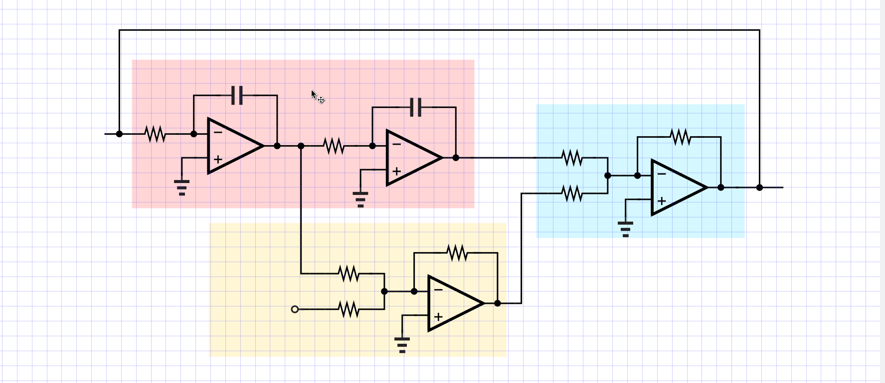

# About

This is a simple script that can be used to "type LaTex" in inkscape using vim.
The steps are outlined below:

- Open vim in a floating terminal. The script uses `urxvt` terminal due to its
  very fast loading times.
- Type something, then save and exit vim
- The script saves the content to a temporary file created in `\tmp`
- This file gets passed to python, which compiles the text into pdf (using
  `pdflatex`), converts the pdf into svg (using `pdf2svg`), and copies the
  content into the clipboard (using `xclip`)
- In the last step, `ctrl+v` is sent (using `xdotool`) to paste the content
  into the active window

## Demo

